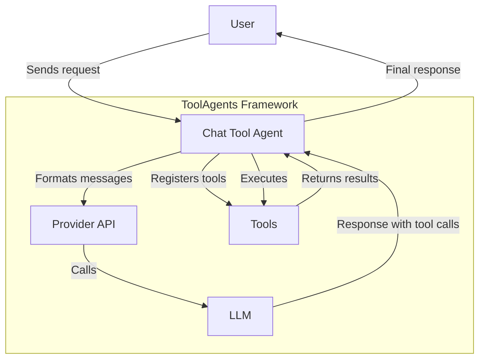

# ToolAgents

ToolAgents is a lightweight and flexible framework for creating function-calling agents with various language models and APIs. It provides a unified interface for integrating different LLM providers and executing function calls seamlessly.

## Overview

ToolAgents aims to provide a consistent way to interact with different language model providers while maintaining a clean, easy-to-use interface for building AI agents that can use tools and functions. Whether you're using OpenAI, Anthropic, Mistral, or other providers, ToolAgents offers a unified approach.

<!-- 
TODO: Add architecture diagram here
{: style="display: block; margin: 0 auto; max-width: 700px"}
-->

## Key Features

- **Multiple LLM Provider Support**: Easily switch between OpenAI, Anthropic, Mistral, and other providers
- **Unified Message Format**: Maintain your chat history across different LLM providers
- **Flexible Tool Creation**: Build tools using Pydantic models, functions, or OpenAI-style function specs
- **Streaming Support**: Get streaming responses for a more responsive experience
- **Memory Management**: Manage chat history and implement memory features
- **Advanced Agent Capabilities**: Create multi-agent systems, research agents, and more

## Quick Links

- [Installation Guide](getting-started/installation.md) - Get started with ToolAgents
- [Basic Usage](guides/basic-usage.md) - Learn the core concepts
- [Custom Tools](guides/custom-tools.md) - Create your own tools
- [Examples](examples/basic-agents.md) - Explore practical applications

## Community and Support

- [GitHub Repository](https://github.com/Maximilian-Winter/ToolAgents)
- [Report Issues](https://github.com/Maximilian-Winter/ToolAgents/issues)