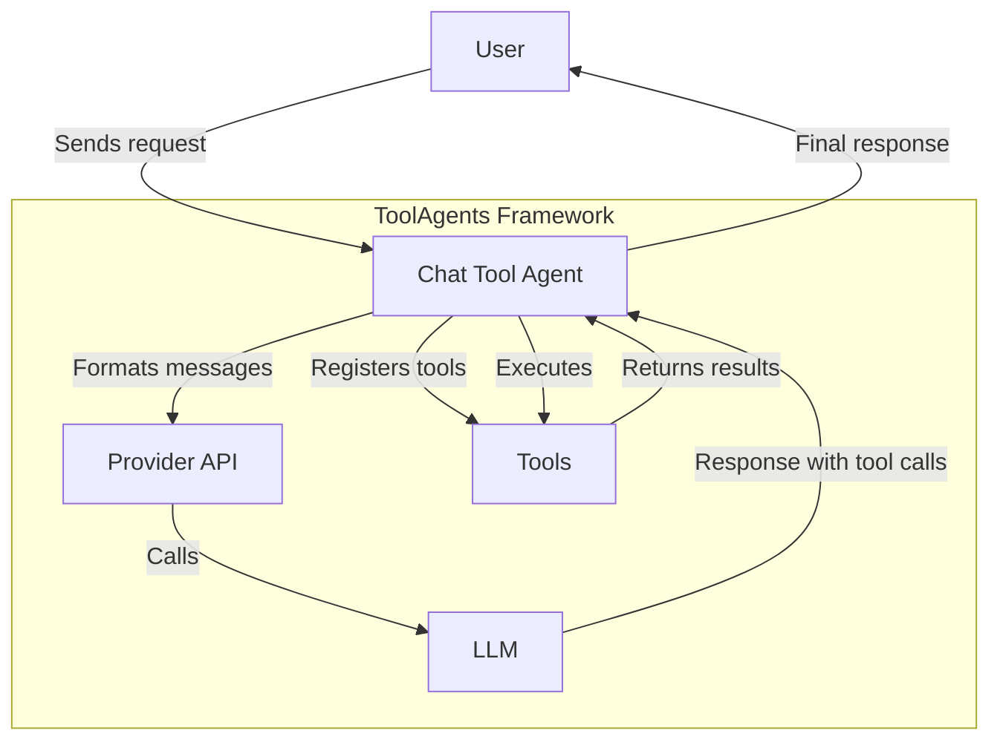

---
title: ToolAgents - A Flexible Framework for LLM Function Calling
---

# ToolAgents

ToolAgents is a lightweight and flexible framework for creating function-calling agents with various language models and APIs. It provides a unified interface for integrating different LLM providers and executing function calls seamlessly.

## Overview

ToolAgents aims to provide a consistent way to interact with different language model providers while maintaining a clean, easy-to-use interface for building AI agents that can use tools and functions. Whether you're using OpenAI, Anthropic, Mistral, or other providers, ToolAgents offers a unified approach.

<!-- 
TODO: Add architecture diagram here
{: style="display: block; margin: 0 auto; max-width: 700px"}
-->

```mermaid
graph TB
    User[User] --> |Sends request| Agent
    
    subgraph "ToolAgents Framework"
        Agent[Chat Tool Agent] --> |Formats messages| Provider
        Agent --> |Registers tools| Tools
        Provider[Provider API] --> |Calls| LLM
        LLM --> |Response with tool calls| Agent
        Agent --> |Executes| Tools
        Tools --> |Returns results| Agent
    end
    
    Agent --> |Final response| User
    
    class User,LLM external
    class Agent,Provider,Tools internal
```

## Key Features

- **Multiple LLM Provider Support**: Easily switch between OpenAI, Anthropic, Mistral, and other providers
- **Custom Endpoints**: Point any provider at a gateway, proxy, or self-hosted server with `base_url`
- **Unified Message Format**: Maintain your chat history across different LLM providers
- **Flexible Tool Creation**: Build tools using Pydantic models, functions, or OpenAI-style function specs
- **Streaming Support**: Get streaming responses for a more responsive experience
- **Memory Management**: Manage chat history and implement memory features
- **Advanced Agent Capabilities**: Create multi-agent systems, research agents, and more
- **A Project CLI**: `tool-agents` runs workflows from a `.tool-agents` folder holding the workflows, tools, prompts, providers and adapters a project needs
- **JSON-Defined Pipelines**: Describe a multi-step workflow — including branching, loops, fan-out, and the endpoints it runs against — in a file rather than in code

## Quick Links

- [Installation Guide](getting-started/installation.md) - Get started with ToolAgents
- [Basic Usage](guides/basic-usage.md) - Learn the core concepts
- [Custom Tools](guides/custom-tools.md) - Create your own tools
- [Pipelines](guides/pipelines.md) - Define multi-step workflows in JSON
- [The tool-agents CLI](guides/cli.md) - Run workflows from a project folder
- [Examples](examples/basic-agents.md) - Explore practical applications

## Community and Support

- [GitHub Repository](https://github.com/Maximilian-Winter/ToolAgents)
- [Report Issues](https://github.com/Maximilian-Winter/ToolAgents/issues)
